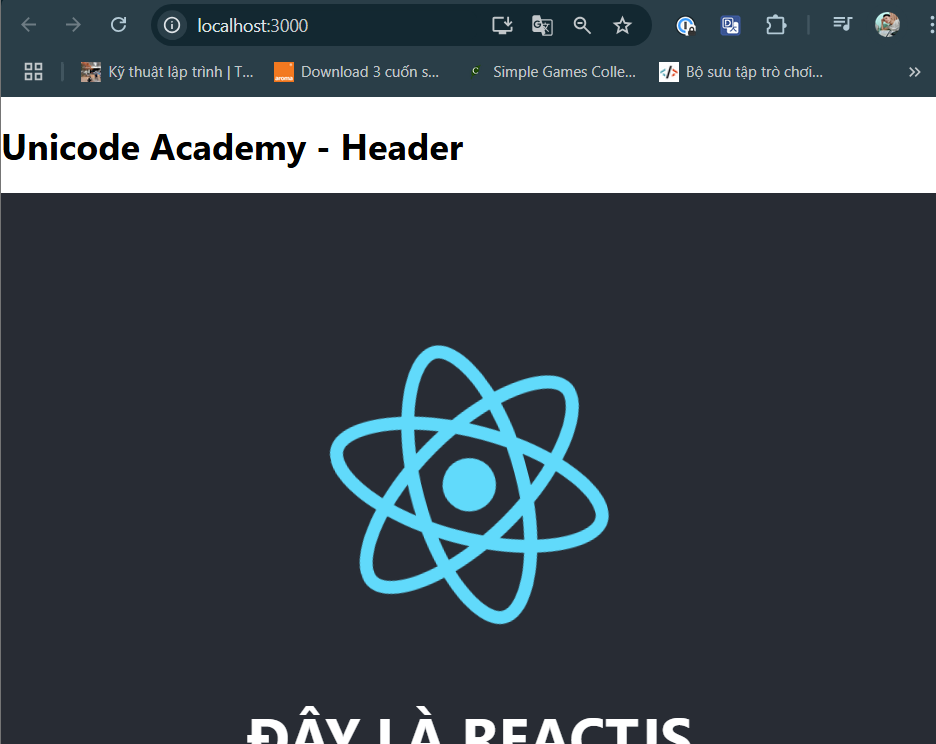

<style>
    img {
        width: 700px;
    }
</style>

# ReactJS render HTML
- Render là quá trình hiển thị nội dung lên trình duyệt cho người dùng nhìn thấy.

- Với ReactJS hoặc các framework hay thư viện hiện đại, các layout không nằm trong file HTML.

- Chúng nằm trong file JS.

- Nhiệm vụ của file HTML là cầu nối giúp nội dung file JS liên kết với trình duyệt.

## Ví dụ
- Mở file `public/index.html`, trong phần body:

    ```html
    <body>
        <noscript>You need to enable JavaScript to run this app.</noscript>
        <div id="root"></div>
        <!--
        This HTML file is a template.
        If you open it directly in the browser, you will see an empty page.

        You can add webfonts, meta tags, or analytics to this file.
        The build step will place the bundled scripts into the <body> tag.

        To begin the development, run `npm start` or `yarn start`.
        To create a production bundle, use `npm run build` or `yarn build`.
        -->
  </body>
    ```

- Chú ý thẻ `div#root` (id có thể thay bằng tên khác hoặc thay bằng class)

- Đây là giao diện hiển thị mà ta nhìn thấy

    

- Xem nguồn trang:

    

    - Ta thấy nó chỉ hiện thị đúng những gì trong file `public/index.html` có

- Tuy nhiên khi ta inspect, sẽ xuất hiện rất nhiều nội dung. Đây là do JS sinh ra. Quá trình này gọi là render HTML.

    

- React sẽ render ứng dụng và thẻ `div#root này`

## Cách ReactJS render HTML lên trình duyệt
- Để hiểu rõ phần này, ta cần nắm 3 files:

### public/index.html
- Là file HTML chính của ứng dụng, chứa cấu trúc chung của một trang HTML

- Không nên chỉnh sửa trực tiếp nội dung trong đây, vì React sẽ tự động cập nhật giao diện.

- Chứa một thẻ div, React sẽ render toàn bộ nội dung vào thẻ div này 

```html
<!DOCTYPE html>
<html lang="en">
<head>
    <meta charset="UTF-8">
    <meta name="viewport" content="width=device-width, initial-scale=1.0">
    <title>My React App</title>
</head>
<body>
    <div id="root"></div>  <!-- React sẽ render vào đây -->
</body>
</html>
```

### src/App.js
- Đây là component chính của ứng dụng React.

- Chứa giao diện và logic của ứng dụng. Sẽ hiển thị nội dung chúng ta muốn hiển thị lên cho người dùng thấy

- Được viết bằng mã JSX

- Liên kết với `public/index.html` thông qua `src/index.js`

- Có thể import thêm các component khác vào đây.

- Ví dụ:
    ```jsx
    import React from "react";

    function App() {
        return (
            <div>
                <h1>Chào mừng đến với React!</h1>
                <p>Đây là một ứng dụng React đơn giản.</p>
            </div>
        );
    }

    export default App;
    ```

- Giải thích:
    - Nó return JSX (gần giống HTML) để hiển thị nội dung.

### src/index.js
- Là file khởi động ứng dụng.

- Từ file `src/index.js`, React sẽ lấy component App từ file `src/App.js` và render nó vào `div#root` ở `public/index.html` sau đó hiển thị nội dung này ra trình duyệt.

- Sử dụng ReactDOM.createRoot() để kết nối React với trình duyệt.

```jsx
const root = ReactDOM.createRoot(document.getElementById('root'));
root.render(
  <React.StrictMode>
    <App /> {/* Gọi đến component App ở App.js */}
  </React.StrictMode>
);
```

- Giải thích:
    - `document.getElementById("root")`:
        - Lấy thẻ `<div id="root"></div>` trong index.html.

    - `ReactDOM.createRoot().render(<App />)`:
        - Hiển thị component App bên trong `<div id="root">`.

### Sơ đồ


## Ví dụ:
- Tạo file src/Header.js

    ```jsx
    function Header() {
        return (
            <h1>
                Unicode Academy - Header
            </h1>
        );
    }

    export default Header;
    ```

- import Header vào App.js và gọi ra:
    ```jsx
    import logo from './logo.svg';
    import './App.css';
    import Header from './Header';

    function App() {
        return (
            <div>
                <Header /> {/* Thêm header */}
                
                <div className="App">
                    <header className="App-header">
                    
                    <h1 className="title">Đây là ReactJS</h1>
                    <p>
                        Chào mừng đến với ReactJS {/* Tại đây */}
                    </p>
                    <a
                        className="App-link"
                        href="https://reactjs.org"
                        target="_blank"
                        rel="noopener noreferrer"
                    >
                        Learn React
                    </a>
                    </header>
                </div>
            </div>


        );
    }

    export default App;
    ```

- Kết quả thu được:

    