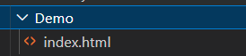
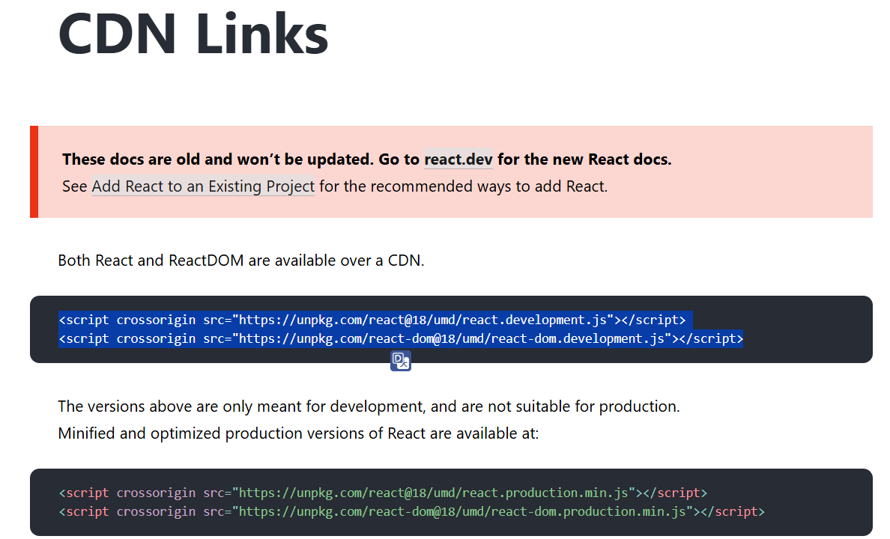
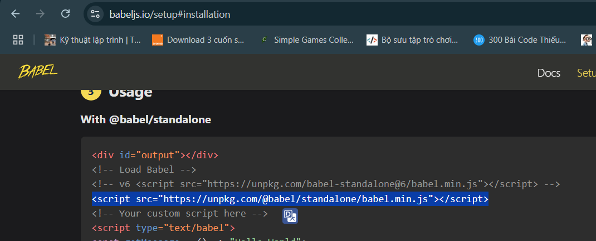
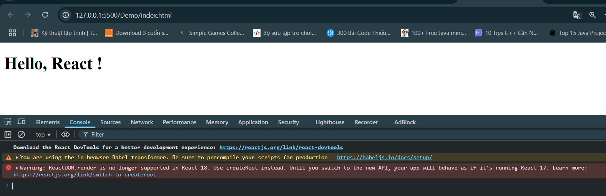
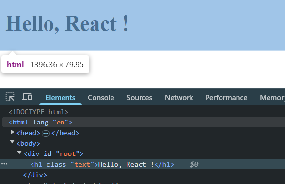
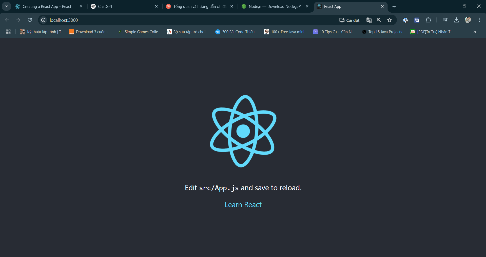
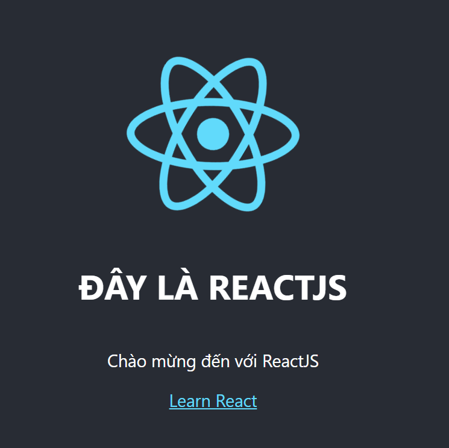

<style>
    img {
        width: 700px;
    }
</style>

# Cài đặt ReactJS (Trình bày 2 cách)
## Cách 1: Sử dụng trực tiếp ReactJS từ CDN thông qua tag `<script>`
- Tạo thư mục Demo, tạo file Demo/index.html

    

- Truy cập: https://legacy.reactjs.org/docs/cdn-links.html#gatsby-focus-wrapper

- Copy đoạn in đậm và dán vào file index.html để tích hợp

    

- Tạo thẻ `div#root`

- Dán thẻ script:
    ```html
    <script type="text/babel">
        ReactDOM.render(
            <h1>Hello, React !</h1>,
            document.getElementById('root')
        );
    </script>
    ```

- Ta thấy có phần babel:
    - Phần này hỗ trợ sử dụng các syntax của JSX

    - Ta cần tích hợp thêm vào

- Truy cập và trang: https://babeljs.io/setup#installation, dán đoạn code này vào file index.html.

    

- Chạy Live Server: Kết quả thu được
    
    

- Nội dung file demo:
    ```html
    <!DOCTYPE html>
    <html lang="en">
    <head>
        <meta charset="UTF-8">
        <meta name="viewport" content="width=device-width, initial-scale=1.0">
        <title>ReactJS Demo</title>
    </head>

    <body>
        <div id="root"></div>
    </body>
    <script crossorigin src="https://unpkg.com/react@18/umd/react.development.js"></script>
    <script crossorigin src="https://unpkg.com/react-dom@18/umd/react-dom.development.js"></script>
    <script src="https://unpkg.com/@babel/standalone/babel.min.js"></script>

    <script type="text/babel">
        ReactDOM.render(
            <h1>Hello, React !</h1>,
            document.getElementById('root')
        );
    </script>

    </html>
    ```

- Ta thấy rằng có lỗi phiên bản, để dùng cho phiên bản thấp hơn, ta thay đổi ở phần thẻ render:
    ```html
    <script type="text/babel">
        const root = ReactDOM.createRoot(document.getElementById('root'));
        root.render(<h1>Hello, React!</h1>);
    </script>
    ```

- Ta thử dùng JSX để thay đổi class (Trong phần script render):
    ```html
    <script type="text/babel">
        const className = "text";
        
        ReactDOM.render(
            <h1 className={className}>Hello, React !</h1>,
            document.getElementById('root')
        );
    </script>
    ```

- Kết quả:

    


## Cách 2: Cài đặt bằng lệnh
https://react.dev/learn/creating-a-react-app#gatsby-focus-wrapper

- Tự động sinh ra cấu trúc folder cho chúng ta

- Ta hoàn toàn có thể chính sửa cấu trúc này

### Bước 1: Cài đặt môi trường Node.js

https://nodejs.org/en/download

- Chạy `node -v` để xem thử cài thành công chưa

### Bước 2: Cài bộ cài app React
- Chạy câu lệnh `npm install -g create-react-app` để tải package ReactJS

### Bước 3: Tạo project
- Tạo proj ReactJS mới: `npx create-react-app name-proj`

- Ta có thể di chuyển code ra bên ngoài folder

### Bước 4: Chạy thử ứng dụng
- Chạy lệnh: `npm start` để chạy proj
    - Kết quả:

    

### Bước 5: Thử chỉnh sửa proj
- Nhìn sơ qua proj:
    - file public/index.html là file chạy chính

- Chỉnh sửa code trong file src/App.js
    ```php
    import logo from './logo.svg';
    import './App.css';

    function App() {
        return (
            <div className="App">
                <header className="App-header">
                    
                    <h1 className="title">Đây là ReactJS</h1>
                    <p>
                        Chào mừng đến với ReactJS {/* Tại đây */}
                    </p>
                    <a
                        className="App-link"
                        href="https://reactjs.org"
                        target="_blank"
                        rel="noopener noreferrer"
                    >
                        Learn React
                    </a>
                </header>
            </div>
        );
    }

    export default App;
    ```

- Thêm css ở file `src/App.css`

    ```css
    .title {
        text-transform: uppercase;
    }
    ```

    - Kết quả:
    
    